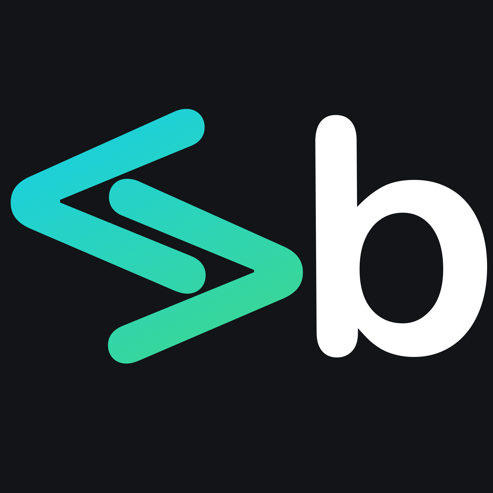

 

# Sponsors

Many thanks to the Upstash team for allowing this project to run on their serverless Redis infrastructure.

<tr>
<td>
  
  
<h3>Upstash: Serverless Database for Redis</h3>

  <ul>
    <li>Serverless Redis with global replication and durable storage</li>
    <li>Price scales to zero with per request pricing</li>
    <li>Built-in REST API designed for serverless and edge functions</li>
  </ul>
  
[Start for free in 30 seconds!](https://upstash.com/?utm_source=Bytecrowds)
</td>
</tr>

# Description

> What's Bytecrowds?

Bytecrowds is a simple and reliable serverless code sharing platform, which goal is to allow programmers to share code with peers in seconds.

> How does it differ from other code sharing platforms?

The infrastructure we use relies on serverless functions to maximize the reliability of the app, making requests on edge and auto-scaling

> Why serverless?

Serverless allows us to focus on code rather than infrastructure operations, which can cause a lot of problems when you need maximum stability and scaling.

# Flow

## Data

The data collected from the platform is stored using Redis data types:

- a bytecrowd is stored as a Redis hash having the following properties:
- text => string
- language => string
- authorizedEmails => string[]
- the analytics data is stored as follows:
- a day's data is stored as a Redis hash having the following properties:
- hits => int
- addresses => string[]
- uniqueVisitors => int
- countries => string[]
- continents => string[]
- pages => string[]
- the general stats are stored as sorted sets as follows:
- continents => { continent: string, score: int }[]
- countries => { country: string, score: int }[]
- pages => { page: string, score: int }[]

# Analytics

Bytecrowds uses a custom analytics engine that sends the current page (with the rest of the data being processed server-side) to a worker the first time a page renders. We then create and update daily and general stats representing the app usage.

# Security

We're using [auth.js](https://authjs.dev) for authentication. Once set, the list of authorized emails for a protected bytecrowd can only be modified from the database directly.

The analytics engine needs to temporarily store the SHA-256 hashes of the visitors' IP addresses to determine the number of unique visitors the site has. Those hashes are regularly deleted.

# How to run?

- Git clone the [frontend](https://github.com/Bytecrowds/frontend) and [analytics](https://github.com/Bytecrowds/analytics) repositories
- Create the .env files and set the variables accordingly
- (optional) Install [wrangler](https://github.com/cloudflare/wrangler2) and deploy a local version of the analytics worker

# Tech stack

## Frontend

- [Next](https://nextjs.org/) : the main frontend framework, allows combined SSG and CSR for better performance
- [SyncedStore](https://syncedstore.org/docs/) : [y.js](https://docs.yjs.dev/) react and [reactive](https://github.com/yousefed/reactive) framework
- [react-codemirror](https://uiwjs.github.io/react-codemirror/) : [codemirror-6](https://codemirror.net/6/) react implementation
- [y.js-codemirror](https://github.com/yjs/y-codemirror) : y.js codemirror adapter

## Serverless Backend

- we are using a custom [Ably](https://ably.com/) provider for syncing the clients ( thanks to the Ably team for helping with this one )
- [Vercel functions](https://vercel.com/docs/concepts/functions/serverless-functions) for interacting with the database
- [Cloudflare workers](https://workers.cloudflare.com/) for the analytics engine
- [Upstash](https://upstash.com/) as the serverless Redis provider

## Other tools

- [LogRocket](https://logrocket.com) for monitoring and error tracking

## How it works?

We use the y.js-codemirror bindings on react-codemirror and connect the editor to the global SyncedStore object, together with the Ably provider. The infrastructure can auto-scale to any number of users.

# IMPORTANT!

This is a unified repository and is updated regularly if needed. To see the timelined version check the [main](https://github.com/Bytecrowds/main) and [analytics](https://github.com/Bytecrowds/analytics) repositories.

# Distinctions

- 1st place at [infoeducatie](https://infoeducatie.ro/) 2022, web section
