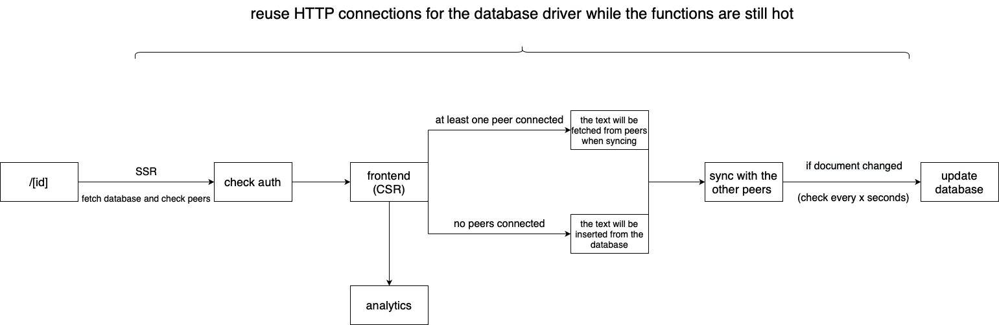

# Description

> What's Bytecrowds?

Bytecrowds is a simple and reliable serverless code sharing platform, which goal is to allow programmers to share code with peers in seconds.

> How does it differ from other code sharing platforms?

The infrastructure we use relies on serverless functions to maximize the reability of the app, making requests on edge and auto-scaling

> Why serverless?

Serverless allows us to focus on code rather than infrastructure operations, which can cause a lot of problems when you need maximum stability and scaling.

> Isn't serverless emptying pockets with that many requests/second?

The short answer would be no. We use [Ably](https://ably.com/) to sync the peers which is a serverless solution created specially for real-time services.
Also, although we are sending a large number of requests to workers and DB, we also don't have any concerns about the speed and realibility of the app, which at scale can become a really challenging cost to deal with, both time and money wise.

# Architecture

## Data

The data collected from the platform is stored using redis data types and cloudflare workers KV:

- a bytecrowd is stored as a redis hash having the following properties:
  - text => string
  - language => string
  - authorizedEmails => string[]
- the analytics data is stored as follows:
  - a day's data is stored as a redish hash having the following properties:
    - hits => int
    - addresses => string[]
    - uniqueVisitors => int
    - countries => string[]
    - continents => string[]
    - pages => string[]
  - the general stats are stored as sorted sets as follows:
    - continents => { continent: string, score: int }[]
    - countries => { country: string, score: int }[]
    - pages => { page: string, score: int }[]

# Analytics

Bytecrowds uses a custom analytics engine that sends the current page (with the rest of the data being processed server-side) to a worker the first time a page renders. We then create and update daily and general stats representing the app usage.

# Security

We're using [auth.js](https://authjs.dev) for authentication. In addition to that, all routes require authentication regardless of the operation and affected resources. The authorizedEmails field can also be modified only from the database directly.

# How to run?

- Git clone the [frontend](https://github.com/Bytecrowds/frontend) and [analytics](https://github.com/Bytecrowds/analytics) repositories
- Create the .env files and set the variables accordingly
- (optional) Install [wrangler](https://github.com/cloudflare/wrangler2) and deploy a local version of the analytics worker

# Tech stack

## Frontend

- [next](https://nextjs.org/) : the main frontend framework, allows combined SSG and CSR for better performance
- [SyncedStore](https://syncedstore.org/docs/) : [y.js](https://docs.yjs.dev/) react and [reactive](https://github.com/yousefed/reactive) framework
- [react-codemirror](https://uiwjs.github.io/react-codemirror/) : [codemirror-6](https://codemirror.net/6/) react implementation
- [y.js-codemirror](https://github.com/yjs/y-codemirror) : y.js codemirror adapter

## Serverless Backend

- we are using a custom [Ably](https://ably.com/) provider for syncing the clients ( thanks to the Ably team for helping with the provider )
- [vercel functions](https://vercel.com/docs/concepts/functions/serverless-functions) for interacting with the database
- [cloudflare workers](https://workers.cloudflare.com/) for the analytics engine
- [upstash](https://upstash.com/) as the serverless redis provider

## How it works?

We use the y.js-codemirror bindings on react-codemirror and connect the editor to the global SyncedStore object, together with the Ably provider. The infrastructure can auto-scale to any number of users.

# IMPORTANT!

This is a unified repository and is updated regularly, if needed. To see the timelined version check the [frontend](https://github.com/Bytecrowds/frontend) and [analytics](https://github.com/Bytecrowds/analytics) repositories.

# Distinctions

- 1st place at [infoeducatie](https://infoeducatie.ro/) 2022, web section
